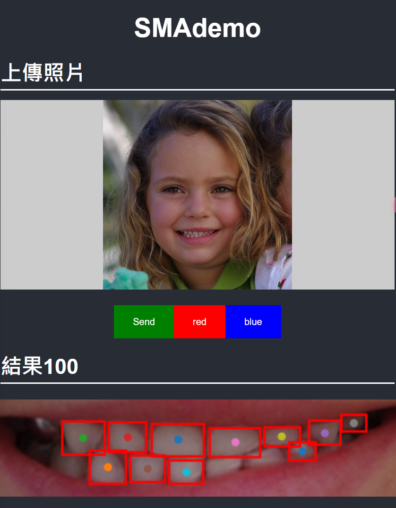

# SMILE
## How to run

### Python?
1. Clone
2. 下載`sam_vit_h_4b8939.pth`放到`app/lib/SMILE/sam_vit_h_4b8939.pth`
   -  [ViT-H SAM model.](https://dl.fbaipublicfiles.com/segment_anything/sam_vit_h_4b8939.pth)
3. 運行 `app/main.py`


### Docker
>Docker 製作中

```shell
cd {dir_path}
```

```shell
docker image build -t smile .
```
```shell
docker run -d -p 7777:8888 --name smile smile
```

停止/移除所有 container
```shell
docker stop $(docker ps -a -q)
docker rm $(docker ps -a -q)
```

## 說明
### 標註
1. SMA 自動產生mask
    - 懶得用flask架成網頁了，只能直接運行 `BuildTraindata.ipynb`
    - input png 照片: `app/TrainData/data/`
1. 手動標註
    - 運行 `app/main.py`
    - 標註介面路徑:[/pages/label](/pages/label)
    - check 後會把標註完的資料送到 `app/TrainData/labeled/`
2. 轉換成CoCo資料集
    - 見 `BuildCoCoDataset.py`, `Train.ipynb`
    - 類別設定: `app\TrainData\labeled\cate.json`

3. 實例分割?
    - [ ] SOLO
    - [ ] 直接對mask用分類器

### YOLOv8 
- 模型訓練放在 ```YOLOv8/```，詳見 ```YOLOv8/TrainYOLO.ipynb```

- flask 網頁 Demo 路徑 /pages/smiledetect




### DEMO

1. SMA Demo:[/pages/SMAdemo](/pages/SMAdemo)
    - 檢查 /app/app.py的註解


[Vedio](https://user-images.githubusercontent.com/106435999/236290831-b03c69f1-92e4-4398-9301-e7288f5ceb6f.mp4)

## 參考資料

1. [SMA期末讀論文作業](https://github.com/hsiu-chan/SMILE/blob/main/Document/%E8%AE%80SMA.pdf)
2. [segment-anything](https://github.com/facebookresearch/segment-anything)
3. [yolact原文](https://github.com/dbolya/yolact)
1. [yolact Keras 實現](
https://github.com/bubbliiiing/yolact-keras)
4. [SOLO 教學](https://medium.com/ching-i/solov2-%E8%A8%93%E7%B7%B4%E6%95%99%E5%AD%B8-90591960b5c7)
5. [YOLOv8](https://docs.ultralytics.com/zh/)
